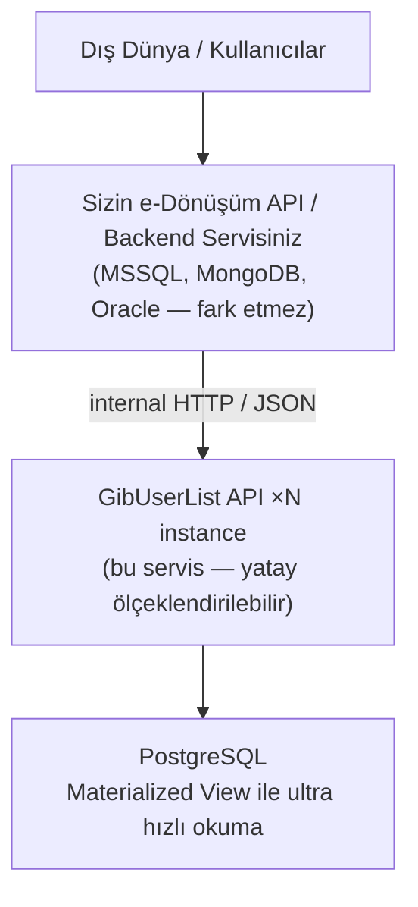
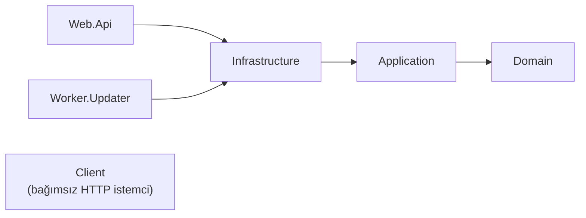
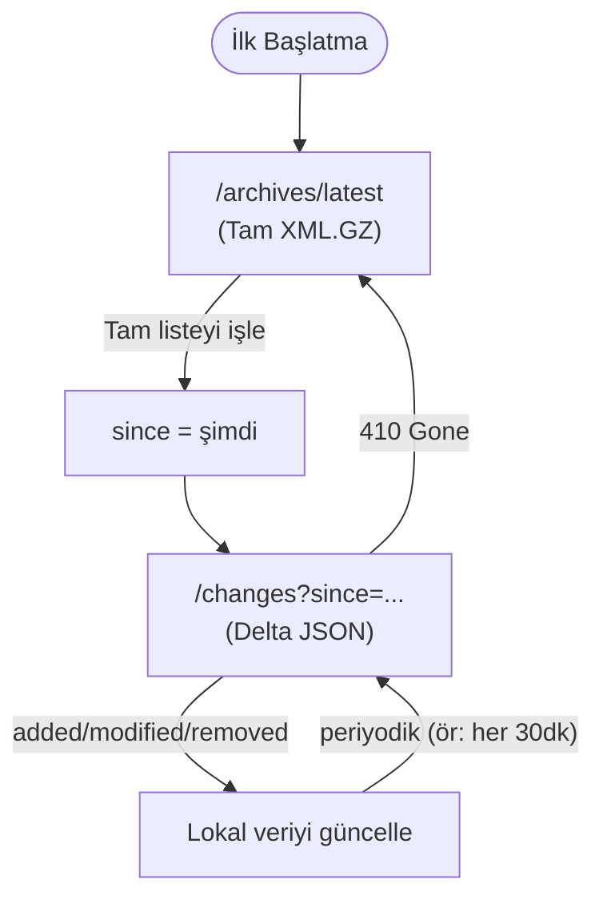

# MERSEL.Services.GibUserList

[](https://github.com/mersel-os/gib-user-list/actions/workflows/ci.yml)
[](https://www.nuget.org/packages/MERSEL.Services.GibUserList.Client)
[](https://www.nuget.org/packages/MERSEL.Services.GibUserList.Client)
[](https://ghcr.io/mersel-os/gibuserlist-api)
[](https://ghcr.io/mersel-os/gibuserlist-worker)
[](LICENSE)

GIB (Gelir İdaresi Başkanlığı) e-Fatura ve e-İrsaliye mükellef listelerini senkronize eden ve sorgulatan **açık kaynak** .NET micro servisi.

---

## Neden Bu Servis?

Türkiye'de e-Fatura ve e-İrsaliye sistemlerinde mükellef sorgulama ihtiyacı hemen her uygulamada tekrar eden bir problemdir. GIB'in yayınladığı PK/GB XML listeleri milyonlarca kaydı barındırır ve bu verileri her uygulamanın kendi bünyesinde yönetmesi ciddi bir teknik yük oluşturur.

Bu servis, bu sorunu **bir kez çözüp tüm iç uygulamalarınıza sunma** felsefesiyle tasarlanmıştır.

### Temel Avantajlar

**~200 MB RAM ile tam senkronizasyon.** Worker, GIB'den indirdiği XML dosyalarını **stream tabanlı ayrıştırma** (XmlReader) ile tek kullanıcı tek kullanıcı okur; hiçbir zaman listenin tamamını belleğe yüklemez. PostgreSQL'in **COPY protokolü** ile 25.000'lik batch'ler halinde doğrudan diske yazar. Bu sayede milyonlarca mükellef kaydını ~200 MB civarı bellek kullanarak güncelleyebilirsiniz. İşi bitince proses kapanır, RAM tamamen serbest kalır.

**PostgreSQL Materialized View ile sıfır kesinti.** Güncelleme sırasında API'nin sorgu hızı düşmez ve kesintiye uğramaz. Veriler önce geçici tablolara yazılır, ardından ana tablolara birleştirilir; API ise her zaman `MATERIALIZED VIEW` üzerinden okur. `REFRESH MATERIALIZED VIEW CONCURRENTLY` sayesinde güncelleme sırasında bile sorgular anında yanıt döner. Bu, MSSQL Server dünyasında doğrudan karşılığı olmayan, PostgreSQL'e özgü güçlü bir yetenektir.

**Veritabanı bağımsız internal micro servis.** Kendi uygulamalarınız MSSQL Server, MongoDB, Oracle veya başka herhangi bir veritabanı kullanıyor olabilir — hiç fark etmez. Bu servisi ağınızda bağımsız bir micro servis olarak ayağa kaldırırsınız; mevcut uygulamalarınız sadece HTTP API'ye istek atar. Kendi veritabanınızda mükellef tablosu tutmanıza, GIB listelerini parse etmenize, güncelleme job'ları yazmanıza gerek kalmaz. PostgreSQL'in gücü, dağıtık bir servis olarak tüm altyapınıza şeffaf şekilde sunulmuş olur.

**Ultra performanslı sorgulama.** VKN/TCKN ile yapılan doğrudan sorgular in-memory cache'ten (veya opsiyonel Redis'ten) sub-millisaniye sürede döner. Arama sorguları PostgreSQL'in `LIKE` + `GIN` index yeteneklerini kullanır. Materialized view üzerinde çalıştığı için ana tablolardaki güncelleme operasyonları sorgu performansını asla etkilemez.

**Her platformda çalışır.** API ve Worker ayrı proseslerdir. Kubernetes'te CronJob + Deployment olarak, Linux'ta systemd + cron olarak veya Windows Server'da Windows Servisi + Zamanlanmış Görev olarak çalıştırabilirsiniz.

**Hazır .NET istemci kütüphanesi.** NuGet paketi olarak dağıtılan `MERSEL.Services.GibUserList.Client` ile mevcut .NET uygulamalarınıza tek satırda entegre olur. HMAC imzalama otomatik olarak yapılır; `IGibUserListClient` arayüzünü inject edip kullanmaya başlarsınız.

**Üretim düzeyinde gözlemlenebilirlik.** OpenTelemetry + Prometheus + Grafana entegrasyonu ile sorgu performansı, senkronizasyon durumu, cache verimliliği ve istemci bazında kullanım detaylarını gerçek zamanlı izleyebilirsiniz. Hazır Grafana dashboard'u ile hemen başlayabilirsiniz.

### Tipik Kullanım Senaryosu

Servis, kullanıcı bazlı bir kimlik doğrulama mekanizması içermediğinden doğrudan dış dünyaya açılması önerilmez. Kendi iç servislerinizi ister HMAC ile ister kimlik doğrulama olmadan bu internal micro servise yönlendirebilirsiniz:



Kendi uygulamanızda mükellef tablosu tutmanıza, GIB XML'lerini parse etmenize gerek kalmaz. Backend servisiniz bu internal micro servise bir HTTP çağrısı yapar, sonucu alır ve kendi iş mantığında kullanır. Veritabanınız ne olursa olsun çalışır.

Micro servis mimarisinde olduğu için API katmanını dilediğiniz kadar yatay ölçeklendirebilirsiniz (Kubernetes HPA, load balancer arkasında N instance). Her instance aynı Materialized View'dan okuduğu için performans sabit kalır ve tek nokta arızası (SPOF) yaşamazsınız.

---

## Mimari



| Proje | Açıklama |
|-------|----------|
| **Domain** | Entity, value object, enum. Sıfır dış bağımlılık. |
| **Application** | Arayüzler, DTO'lar, CQRS sorgu handler'ları, FluentValidation. |
| **Infrastructure** | EF Core, PostgreSQL, önbellekleme, GIB XML senkronizasyonu, metrikler. |
| **Web.Api** | Minimal API, Scalar UI, HMAC kimlik doğrulama, Prometheus `/metrics`. |
| **Worker.Updater** | Bağımsız iş — GIB listelerini indirir, DB'yi günceller, çıkar. |
| **Client** | NuGet paketi olarak dağıtılabilir .NET HTTP istemcisi. |

---

## Hızlı Başlangıç

### Docker Compose ile

```bash
cd docker
docker compose up -d
```

Bu komut şunları başlatır:

| Servis | Adres |
|--------|-------|
| PostgreSQL 17 | `localhost:5432` |
| API | http://localhost:8080 |
| Scalar API Dokümantasyonu | http://localhost:8080/scalar/v1 |
| Sağlık Kontrolü | http://localhost:8080/health |
| Worker | Çalışır, verileri senkronize eder, çıkar |

### Monitoring Stack ile (Prometheus + Grafana)

```bash
cd monitoring

# Gerekli ortam değişkenleri (.env dosyasına veya shell'e tanımlayın)
export POSTGRES_PASSWORD=gizli-sifre
export GRAFANA_ADMIN_PASSWORD=grafana-sifre
export SLACK_WEBHOOK_URL=https://hooks.slack.com/services/T.../B.../xxx

docker compose up -d
```

| Servis | Adres | Kimlik |
|--------|-------|--------|
| API | http://localhost:8080 | — |
| Prometheus | http://localhost:9090 | — |
| Grafana | http://localhost:3000 | `admin` / `$GRAFANA_ADMIN_PASSWORD` |
| Metrikler | http://localhost:8080/metrics | — |

---

## Yapılandırma

Tüm ayarlar ortam değişkenleri veya `appsettings.json` ile yapılır:

### Veritabanı

```bash
ConnectionStrings__DefaultConnection=Host=localhost;Database=gib_user_list;Username=postgres;Password=postgres
```

### GIB Uç Noktaları

```bash
# Canlı ortam (varsayılan)
# GibEndpoints__PkListUrl=https://merkez.gib.gov.tr/EFaturaMerkez/newUserPkListxml.zip
# GibEndpoints__GbListUrl=https://merkez.gib.gov.tr/EFaturaMerkez/newUserGbListxml.zip

# Test ortamı
GibEndpoints__PkListUrl=https://merkeztest.gib.gov.tr/EFaturaMerkez/newUserPkListxml.zip
GibEndpoints__GbListUrl=https://merkeztest.gib.gov.tr/EFaturaMerkez/newUserGbListxml.zip

GibEndpoints__BatchSize=25000                # COPY batch boyutu (varsayılan: 25000, maks: 100000)
GibEndpoints__DownloadTimeout=00:30:00       # İndirme zaman aşımı (varsayılan: 30 dk, maks: 1 saat)
GibEndpoints__ChangeRetentionDays=30         # Changelog saklama süresi (1-365 gün)
GibEndpoints__MaxAllowedRemovalPercent=10    # Güvenli silme eşiği (%)
```

> **Güvenli Silme Koruyucusu:** Senkronizasyon sırasında silinecek mükellef oranı `MaxAllowedRemovalPercent` eşiğini aşarsa (örn. GIB'den hatalı/boş liste gelmesi durumunda) silme işlemi otomatik olarak atlanır ve webhook bildirimi gönderilir. Bu, veri kaybını önleyen kritik bir koruma mekanizmasıdır.

### Önbellekleme

```bash
# "Memory" (varsayılan) veya "Redis"
Caching__Provider=Memory
Caching__DefaultTtlMinutes=60
Caching__RedisInstanceName=gibuserlist:
Caching__RedisConnectionString=localhost:6379
```

> **Not:** Yalnızca VKN/TCKN ile yapılan doğrudan sorgular (`/api/v1/einvoice/{identifier}`) önbelleğe alınır. Arama sorguları her zaman veritabanından gelir.

### Arşiv Depolama

```bash
# FileSystem (varsayılan)
ArchiveStorage__Provider=FileSystem
ArchiveStorage__BasePath=/data/gib-archives
ArchiveStorage__RetentionDays=7

# S3 / MinIO
ArchiveStorage__Provider=S3
ArchiveStorage__BucketName=gib-archives
ArchiveStorage__Region=eu-west-1
ArchiveStorage__AccessKey=                   # Boş bırakılırsa IAM role kullanılır
ArchiveStorage__SecretKey=
ArchiveStorage__ServiceUrl=http://minio:9000 # MinIO veya S3-uyumlu endpoint (opsiyonel)
```

### Sağlık Kontrolü

```bash
HealthChecks__MaxSyncStalenessHours=24    # Son sync'in bayat sayılma eşiği (saat, varsayılan: 24)
```

Servis üç sağlık kontrolü çalıştırır:

| Kontrol | Açıklama |
|---------|----------|
| `postgresql` | Veritabanı bağlantısı |
| `sync_freshness` | Son senkronizasyonun yaşı `MaxSyncStalenessHours` altında mı |
| `archive_storage` | Arşiv depolama alanı erişilebilir mi |

Durum geçişleri (ör: Healthy → Degraded) webhook ile bildirilir.

### Kimlik Doğrulama (HMAC-SHA256)

İki mod desteklenir:

**Devre dışı (varsayılan):** Tüm istekler anonim geçer.

```bash
Authentication__Enabled=false
```

**HMAC aktif:** Her istemci `AccessKey` + `SecretKey` çifti ile tanımlanır.

```bash
Authentication__Enabled=true
Authentication__TimestampToleranceSeconds=300
Authentication__Clients__0__AccessKey=belgehub-prod
Authentication__Clients__0__SecretKey=gizli-anahtar-buraya
Authentication__Clients__0__Name=BelgeHub
```

HMAC aktifken istemci her istekte şu başlıkları gönderir:

| Başlık | Açıklama |
|--------|----------|
| `X-Access-Key` | İstemcinin public erişim anahtarı |
| `X-Timestamp` | Unix epoch (saniye) |
| `X-Signature` | `HMAC-SHA256(SecretKey, "{METHOD}\n{PathAndQuery}\n{Timestamp}")` hex kodlu |

Sunucu tarafında timestamp toleransı (varsayılan 5 dk) ve sabit-zaman imza karşılaştırması uygulanır.

### Webhook Bildirimleri

Kritik olaylar için Slack ve/veya HTTP webhook desteği bulunur. Varsayılan olarak kapalıdır; ortam değişkenleri ile etkinleştirilir.

**Ana anahtar:**

```bash
Webhooks__Enabled=true

# Servis adı ve ortam - otomatik ASPNETCORE_ENVIRONMENT ve ASPNETCORE_APPLICATIONNAME'den alınır
# Aşağıdaki gibi config üzerinden override edilebilir:
Webhooks__ServiceName=GibUserListService
Webhooks__Environment=Production
```

**Slack:**

```bash
Webhooks__Slack__Enabled=true
Webhooks__Slack__WebhookUrl=https://hooks.slack.com/services/T.../B.../xxx
Webhooks__Slack__Channel=#gib-sync-alerts
Webhooks__Slack__Username=GIB Sync Bot
```

Slack bildirimleri önem derecesine göre renklendirilmiş Block Kit mesajları olarak gönderilir (kırmızı = kritik, turuncu = uyarı, yeşil = bilgi).

**HTTP:**

```bash
Webhooks__Http__Enabled=true
Webhooks__Http__Url=https://api.example.com/hooks/gib-sync
Webhooks__Http__Secret=hmac-gizli-anahtar
Webhooks__Http__TimeoutSeconds=10
```

HTTP webhook JSON body ile POST eder. `Secret` tanımlıysa gövdenin HMAC-SHA256 imzası `X-Webhook-Signature: sha256=...` başlığında gönderilir. Ek başlıklar: `X-Webhook-Event`, `X-Webhook-Timestamp`, `X-Webhook-ServiceName`, `X-Webhook-Environment`.

**Olay filtreleme:** Her kanal hangi olayları alacağını bağımsız olarak seçebilir:

```bash
# Slack'e yalnızca hatalar gitsin
Webhooks__Slack__NotifyOn__0=SyncFailed
Webhooks__Slack__NotifyOn__1=MvRefreshFailed
Webhooks__Slack__NotifyOn__2=HealthStatusChanged

# HTTP'ye tüm olaylar gitsin
Webhooks__Http__NotifyOn__0=SyncCompleted
Webhooks__Http__NotifyOn__1=SyncFailed
Webhooks__Http__NotifyOn__2=SyncPartial
Webhooks__Http__NotifyOn__3=RemovalGuardTriggered
Webhooks__Http__NotifyOn__4=MvRefreshFailed
Webhooks__Http__NotifyOn__5=HealthStatusChanged
```

`NotifyOn` boş bırakılırsa ilgili kanala tüm olaylar gönderilir.

**Desteklenen olaylar:**

| Olay | Önem | Açıklama |
|------|------|----------|
| `SyncCompleted` | Bilgi | Senkronizasyon başarıyla tamamlandı |
| `SyncFailed` | Kritik | Senkronizasyon başarısız oldu (hata detayı ile) |
| `SyncPartial` | Uyarı | Advisory lock çakışması veya arşiv uyarıları |
| `RemovalGuardTriggered` | Uyarı | Güvenli silme koruyucusu toplu silmeyi engelledi |
| `MvRefreshFailed` | Kritik | Materialized view yenileme tüm denemelerde başarısız |
| `HealthStatusChanged` | Değişken | Sağlık kontrolü durumu değişti (ör: Healthy → Degraded) |

`HealthStatusChanged` olayı sadece durum **geçişlerinde** tetiklenir (her yoklama döngüsünde değil). Üç sağlık kontrolünü kapsar: `postgresql`, `sync_freshness`, `archive_storage`. Yeni duruma göre önem derecesi: Healthy=bilgi (toparlanma), Degraded=uyarı, Unhealthy=kritik.

Webhook gönderim hataları ana iş akışını **asla engellemez** — yalnızca loglanır.

---

## API Uç Noktaları

### Sorgulama

| Method | Yol | Açıklama |
|--------|-----|----------|
| `GET` | `/api/v1/einvoice/{identifier}?firstCreationTime=...` | VKN/TCKN ile e-Fatura mükellefi sorgula (opsiyonel tarih filtresi) |
| `GET` | `/api/v1/einvoice?search=...&page=1&pageSize=20` | e-Fatura mükellefi ara (ünvan veya kimlik no) |
| `POST` | `/api/v1/einvoice/batch` | Toplu VKN/TCKN ile e-Fatura mükellefi sorgula (maks 100) |
| `GET` | `/api/v1/edespatch/{identifier}?firstCreationTime=...` | VKN/TCKN ile e-İrsaliye mükellefi sorgula |
| `GET` | `/api/v1/edespatch?search=...&page=1&pageSize=20` | e-İrsaliye mükellefi ara |
| `POST` | `/api/v1/edespatch/batch` | Toplu VKN/TCKN ile e-İrsaliye mükellefi sorgula (maks 100) |

### Değişiklik Takibi (Delta Sync)

| Method | Yol | Açıklama |
|--------|-----|----------|
| `GET` | `/api/v1/einvoice/changes?since=...&until=...&page=1&pageSize=100` | Belirtilen tarih aralığındaki e-Fatura değişikliklerini getir |
| `GET` | `/api/v1/edespatch/changes?since=...&until=...&page=1&pageSize=100` | e-İrsaliye değişiklikleri |

| Parametre | Zorunlu | Açıklama |
|-----------|---------|----------|
| `since` | Evet | Bu tarihten sonraki değişiklikler (ISO 8601) |
| `until` | Hayır | Bu tarihe kadar olan değişiklikler (varsayılan: şu an) |
| `page` | Hayır | Sayfa numarası (varsayılan: 1) |
| `pageSize` | Hayır | Sayfa boyutu, 1-1000 arası (varsayılan: 100) |

Yanıt her kayıt için `changeType` alanı içerir: `added`, `modified` veya `removed`. Retention süresi (`ChangeRetentionDays`, varsayılan 30 gün) dışındaki istekler **410 Gone** döner — bu durumda tüketici tam listeyi yeniden indirmelidir.

### Yanıt Başlıkları

Tüm sorgu ve arşiv endpoint'leri yanıtta `X-Last-Sync-At` başlığını döner. Bu başlık son başarılı senkronizasyonun zamanını ISO 8601 formatında içerir. Tüketiciler bu değeri bir sonraki `/changes` çağrısında `since` parametresi olarak kullanabilir.

```
X-Last-Sync-At: 2026-02-19T03:05:12.0000000+03:00
```

### Arşiv (Tam Liste)

| Method | Yol | Açıklama |
|--------|-----|----------|
| `GET` | `/api/v1/einvoice/archives` | e-Fatura arşiv dosyalarını listele |
| `GET` | `/api/v1/einvoice/archives/latest` | En son e-Fatura tam listesi (XML.GZ) |
| `GET` | `/api/v1/einvoice/archives/{fileName}` | Belirli bir arşiv dosyasını indir |
| `GET` | `/api/v1/edespatch/archives` | e-İrsaliye arşiv dosyalarını listele |
| `GET` | `/api/v1/edespatch/archives/latest` | En son e-İrsaliye tam listesi (XML.GZ) |
| `GET` | `/api/v1/edespatch/archives/{fileName}` | Belirli bir arşiv dosyasını indir |

Her sync sonrası PK ve GB verileri birleştirilerek belge türüne göre ayrı XML.GZ arşivleri üretilir. Bu arşivler tüm aktif mükelleflerin tam listesini içerir ve tüketici bootstrap'ı için kullanılır.

### Durum ve Sağlık

| Method | Yol | Açıklama |
|--------|-----|----------|
| `GET` | `/api/v1/status` | Senkronizasyon durumu (`success/partial/failed`), hata özeti ve mükellef sayıları |
| `GET` | `/health` | Sağlık kontrolü (PostgreSQL dahil) |
| `GET` | `/metrics` | Prometheus metrikleri |

### API Dokümantasyonu

Development ortamında **Scalar UI** otomatik olarak aktiftir:

```
http://localhost:8080/scalar/v1
```

---

## Tüketici Senkronizasyon Protokolü

Bu servis, tüketicilerin (istemci uygulamaların) mükellef listesini verimli şekilde güncel tutmasını sağlayan bir protokol sunar:



**Adımlar:**

1. **Bootstrap:** `/api/v1/einvoice/archives/latest` ile tam listeyi XML.GZ olarak indir. Bu dosya PK+GB verisi birleştirilmiş, sadece ilgili belge türünü içeren tüm aktif mükellefleri barındırır.

2. **Delta Takibi:** Periyodik olarak `/api/v1/einvoice/changes?since=...` ile son kontrol zamanından bu yana olan değişiklikleri sorgula. Her kayıt `added`, `modified` veya `removed` olarak işaretlenmiştir.

3. **Re-bootstrap:** Eğer `/changes` endpoint'i **410 Gone** döndürürse, tüketicinin `since` değeri retention süresi dışına düşmüş demektir. Bu durumda tekrar `/archives/latest` ile tam listeyi indir.

### İstemci Kodu Örneği

```csharp
public async Task SyncLocalDatabase(IGibUserListClient client, CancellationToken ct)
{
    try
    {
        // Delta ile güncelle
        var changes = await client.GetEInvoiceChangesAsync(since: _lastSyncTime, ct: ct);
        foreach (var change in changes.Data.Changes)
        {
            switch (change.ChangeType)
            {
                case "added":
                case "modified":
                    await UpsertLocalUser(change);
                    break;
                case "removed":
                    await DeleteLocalUser(change.Identifier);
                    break;
            }
        }
        _lastSyncTime = changes.LastSyncAt ?? DateTime.Now;
    }
    catch (GibUserListSyncExpiredException)
    {
        // 410 Gone — tam listeyi tekrar indir
        var archive = await client.GetLatestEInvoiceArchiveAsync(ct);
        if (archive.Data is not null)
        {
            await RebuildLocalDatabase(archive.Data); // XML.GZ stream
        }
    }
}
```

---

## .NET İstemci Kütüphanesi

### Kurulum

```bash
dotnet add package MERSEL.Services.GibUserList.Client
```

### Kayıt (Auth devre dışı)

```csharp
builder.Services.AddGibUserListClient(options =>
{
    options.BaseUrl = "https://gib-gibuser.example.com";
});
```

### Kayıt (HMAC kimlik doğrulamalı)

```csharp
builder.Services.AddGibUserListClient(options =>
{
    options.BaseUrl = "https://gib-gibuser.example.com";
    options.AccessKey = "belgehub-prod";
    options.SecretKey = "gizli-anahtar-buraya";
});
```

> `AccessKey` ve `SecretKey` verildiğinde tüm çıkan istekler otomatik olarak HMAC-SHA256 ile imzalanır.

### IConfiguration ile kayıt

```csharp
// appsettings.json:
// "GibUserListClient": {
//   "BaseUrl": "https://gib-gibuser.example.com",
//   "AccessKey": "belgehub-prod",
//   "SecretKey": "gizli-anahtar-buraya"
// }

builder.Services.AddGibUserListClient(builder.Configuration);
```

### Kullanım

```csharp
public class MyService(IGibUserListClient gibuserClient)
{
    public async Task Example(CancellationToken ct)
    {
        // VKN/TCKN ile sorgula
        var gibuser = await gibuserClient.GetEInvoiceGibUserAsync("1234567890", ct: ct);

        // Belirli bir tarihten önce kayıtlı mı? (firstCreationTime filtresi)
        var before = await gibuserClient.GetEInvoiceGibUserAsync(
            "1234567890", firstCreationTime: new DateTime(2024, 1, 1), ct: ct);

        // Ünvana göre ara
        var results = await gibuserClient.SearchEInvoiceGibUsersAsync("MERSEL", ct: ct);

        // Toplu sorgulama (maks 100 VKN/TCKN)
        var batch = await gibuserClient.BatchGetEInvoiceGibUsersAsync(
            ["1234567890", "9876543210", "11111111111"], ct);

        // e-İrsaliye mükellefi sorgula
        var despatch = await gibuserClient.GetEDespatchGibUserAsync("1234567890", ct: ct);

        // Değişiklik takibi (delta sync)
        var changes = await gibuserClient.GetEInvoiceChangesAsync(
            since: DateTime.Now.AddHours(-1), ct: ct);

        // Tam mükellef listesi arşivi (bootstrap için)
        var archive = await gibuserClient.GetLatestEInvoiceArchiveAsync(ct);
        // archive.Data = XML.GZ stream

        // Arşiv dosyalarını listele
        var archiveList = await gibuserClient.ListEInvoiceArchivesAsync(ct);

        // Senkronizasyon durumunu kontrol et
        var status = await gibuserClient.GetSyncStatusAsync(ct);
    }
}
```

---

## Dağıtım

API ve Worker ayrı proseslerdir. API sürekli çalışır ve sorguları yanıtlar; Worker periyodik olarak tetiklenir, GIB verilerini günceller ve kapanır. Bu ayrım sayesinde güncelleme sırasında API performansı etkilenmez ve Worker'ın kullandığı bellek işi bitince tamamen serbest kalır.

### Kubernetes

```bash
kubectl apply -f k8s/api-deployment.yaml
kubectl apply -f k8s/updater-cronjob.yaml
```

- **API:** Deployment + HPA ile yatay ölçeklendirme, sürekli çalışır
- **Worker:** CronJob, günde 4 kez çalışır (03:00, 09:00, 15:00, 21:00 sunucu saati), bitince kapanır ve pod silinir. `concurrencyPolicy: Forbid` ile aynı anda birden fazla çalışması engellenir.

Kubernetes ortamında bu en temiz çözümdür. CronJob her tetiklendiğinde yeni bir pod oluşturur, Worker işini bitirir ve pod otomatik olarak temizlenir. Schedule `k8s/updater-cronjob.yaml` dosyasından özelleştirilebilir.

### Linux (systemd + cron)

```bash
# API: systemd servisi olarak
sudo cp gibuserlist-api.service /etc/systemd/system/
sudo systemctl enable --now gibuserlist-api

# Worker: crontab ile periyodik tetikleme
# Her gün 03:00'da çalıştır
echo "0 3 * * * /opt/gib-gibuser/Worker.Updater" | sudo crontab -
```

### Docker Compose (geliştirme / küçük ölçek)

```bash
cd docker
docker compose up -d
```

PostgreSQL, API ve Worker tek komutla ayağa kalkar. Worker çalışır, verileri günceller ve çıkar; diğer servisler çalışmaya devam eder.

### Windows Server

Windows ortamlarda API, Windows Servisi olarak; Worker ise Zamanlanmış Görev (Task Scheduler) ile periyodik olarak çalıştırılabilir. Talep edilmesi halinde Windows dağıtımı için detaylı destek sağlanabilir.

---

## Veritabanı Şeması

Worker ilk çalıştığında gerekli şemayı otomatik oluşturur:

| Tablo / Nesne | Tür | Açıklama |
|----------------|-----|----------|
| `gib_user_temp_pk` | Geçici tablo | PK listesi için COPY staging alanı |
| `gib_user_temp_gb` | Geçici tablo | GB listesi için COPY staging alanı |
| `e_invoice_gib_users` | Ana tablo | e-Fatura mükellefleri (`content_hash` ile diff destekli) |
| `e_despatch_gib_users` | Ana tablo | e-İrsaliye mükellefleri (`content_hash` ile diff destekli) |
| `gib_user_changelog` | Changelog tablosu | Değişiklik kayıtları: `added`, `modified`, `removed` |
| `mv_e_invoice_gib_users` | Materialized View | Sıfır kesinti okuma (API buradan okur) |
| `mv_e_despatch_gib_users` | Materialized View | Sıfır kesinti okuma (API buradan okur) |
| `sync_metadata` | Metadata tablosu | Son senkronizasyon zamanı, durum (`success/partial/failed`), hata özeti ve sayılar |

### Arşiv Dosya Yapısı

Her sync sonrası PK ve GB verileri birleştirilerek belge türüne göre ayrı arşivler üretilir:

```
archives/
├── einvoice/
│   ├── einvoice_users_2026-02-17_030000.xml.gz   ← en son tam liste
│   └── einvoice_users_2026-02-16_030000.xml.gz
└── edespatch/
    ├── edespatch_users_2026-02-17_030000.xml.gz
    └── edespatch_users_2026-02-16_030000.xml.gz
```

Arşivler FileSystem (`/data/gib-archives`) veya S3/MinIO üzerinde saklanabilir.

---

## Nasıl Çalışır

### Worker.Updater — Senkronizasyon Akışı

```
  1. GIB'den PK + GB ZIP dosyalarını paralel indir (retry destekli)
  2. ZIP'ten XML dosyalarını çıkar
  3. XmlReader ile akış tabanlı parse (tüm listeyi belleğe yüklemez)
  4. PostgreSQL COPY protokolü ile geçici tablolara toplu yaz (25K batch)
  5. Advisory Lock (pg_try_advisory_xact_lock) — eş zamanlı sync çalışmasını engeller
  6. Diff Engine — content_hash ile değişiklik tespiti:
     • Yeni kullanıcılar → ana tabloya INSERT + changelog'a "added"
     • Hash değişen kullanıcılar → ana tabloya UPDATE + changelog'a "modified"
     • Listeden çıkan kullanıcılar → ana tablodan HARD DELETE + changelog'a "removed"
     • Safe removal guard: toplam silme yüzdesi eşik aşarsa silme atlanır
  7. REFRESH MATERIALIZED VIEW CONCURRENTLY (retry destekli, maks 3 deneme)
  8. Belge türüne göre XML.GZ arşiv üret (PK+GB birleşik, Invoice ve DespatchAdvice ayrı)
  9. Eski arşiv dosyalarını retention'a göre temizle
 10. sync_metadata güncelle (son sync zamanı, durum, hata özeti, mükellef sayıları)
 11. Webhook bildirimi gönder (Slack ve/veya HTTP)
 12. Çık — proses sonlanır, ~200 MB RAM tamamen serbest kalır
```

**Neden stream tabanlı?** GIB'in mükellef XML listeleri milyonlarca kayıt içerir. Tüm dosyayı belleğe yükleyip `XmlDocument` veya `XmlSerializer` ile deserialize etmek gigabyte'larca RAM tüketir. Bu servis `XmlReader` ile tek kayıt tek kayıt okur ve her 25.000 kayıtta PostgreSQL'e COPY ile yazar. Bu sayede toplam bellek tüketimi ~200 MB civarında kalır ve Windows Server'larda bile rahatça çalışır.

**Neden Materialized View?** Worker güncelleme yaparken API tarafı kesintisiz çalışmaya devam etmelidir. `REFRESH MATERIALIZED VIEW CONCURRENTLY` PostgreSQL'e özgü güçlü bir yetenektir: eski veri okunmaya devam ederken arka planda yeni veri hazırlanır, tamamlandığında atomik olarak değiştirilir. MV yenileme başarısız olursa 5 saniye aralıklarla 2 kez daha denenir; tüm denemeler başarısız olursa kritik webhook bildirimi gönderilir. MSSQL Server'da bu davranışın doğrudan karşılığı yoktur — bu servis, PostgreSQL'in bu gücünü sizin için dağıtık bir API olarak sunar.

**Advisory Lock ile eşzamanlılık koruması.** Worker, sync işlemini başlatmadan önce PostgreSQL advisory lock (`pg_try_advisory_xact_lock`) alır. Bu sayede birden fazla Worker instance'ı (ör: CronJob retry, manuel tetikleme) aynı anda çalışsa bile yalnızca biri veri işleme yapar; diğerleri "partial" durumu ile çıkar ve webhook bildirir.

### Diff & Changelog Mekanizması

Worker, ardışık iki senkronizasyon arasındaki farkı `content_hash` karşılaştırması ile tespit eder ve değişiklikleri `gib_user_changelog` tablosuna yazar. Tüketici uygulamalar `/changes?since=...` endpoint'i ile yalnızca delta değişiklikleri sorgulayabilir.

Bu mekanizmanın ayrıntılı teknik dokümantasyonu için bkz. **[docs/CHANGELOG_MECHANISM.md](docs/CHANGELOG_MECHANISM.md)** — içerik olarak diff SQL'leri, ilk senkronizasyon davranışı, retention politikası, güvenlik mekanizmaları, tüketici kuralları ve zaman çizelgesi bazlı senaryo analizini kapsar.

### Web.Api — Sorgulama Akışı

```
  1. İstek gelir → HMAC doğrulama (aktifse)
  2. VKN/TCKN sorguları: önce cache kontrol → isabet varsa anında dön
  3. Cache'te yoksa: Materialized View'dan oku → cache'e yaz → yanıt dön
  4. Arama sorguları: her zaman Materialized View'dan oku (cache'lenmez)
  5. JSON yanıt dön (sub-millisaniye ~ birkaç ms)
```

---

## Gözlemlenebilirlik (Observability)

### Metrikler

Prometheus uyumlu `/metrics` endpoint'i aşağıdaki özel metrikleri sunar:

| Metrik | Tür | Açıklama |
|--------|-----|----------|
| `gibuserlist_queries_total` | Counter | Toplam sorgu sayısı (`type`, `document_type`) |
| `gibuserlist_queries_duration_milliseconds` | Histogram | Sorgu süresi (ms) |
| `gibuserlist_queries_errors_total` | Counter | Başarısız sorgu sayısı |
| `gibuserlist_sync_total` | Counter | Senkronizasyon sayısı (`status`) |
| `gibuserlist_sync_duration_seconds` | Histogram | Senkronizasyon süresi (s) |
| `gibuserlist_sync_users_processed_total` | Counter | İşlenen kullanıcı sayısı (`list_type`) |
| `gibuserlist_sync_active` | UpDownCounter | Aktif senkronizasyon sayısı |
| `gibuserlist_cache_hits_total` | Counter | Önbellek isabet sayısı |
| `gibuserlist_cache_misses_total` | Counter | Önbellek ıskalama sayısı |
| `gibuserlist_auth_requests_total` | Counter | Auth isteği sayısı (`client`, `status`, `reason`) |
| `gibuserlist_sync_changes_total` | Counter | Tespit edilen değişiklik sayısı (`change_type`: added/modified/removed) |
| `gibuserlist_sync_removal_skipped_total` | Counter | Güvenli silme koruyucusu tetiklenme sayısı |
| `gibuserlist_mv_refresh_duration_seconds` | Histogram | Materialized view yenileme süresi (s) |
| `gibuserlist_mv_refresh_errors_total` | Counter | MV yenileme hata sayısı |
| `gibuserlist_users_einvoice_count` | Gauge | Aktif e-Fatura mükellef sayısı |
| `gibuserlist_users_edespatch_count` | Gauge | Aktif e-İrsaliye mükellef sayısı |
| `gibuserlist_sync_last_duration_seconds` | Gauge | Son senkronizasyon süresi (s) |
| `gibuserlist_sync_last_sync_at_unix` | Gauge | Son senkronizasyon zamanı (Unix epoch) |
| `gibuserlist_process_uptime_seconds` | Gauge | API proses çalışma süresi (s) |

Ek olarak ASP.NET Core HTTP metrikleri ve .NET Runtime metrikleri (GC, thread pool, bellek) otomatik olarak toplanır.

> **Not:** Gauge metrikleri (kullanıcı sayıları, son sync zamanı/süresi) Worker ayrı bir process olduğu için doğrudan Worker'dan Prometheus'a aktarılamaz. Bunun yerine API process'i `sync_metadata` tablosundan periyodik olarak okuyarak Prometheus'a sunar.

### Grafana Dashboard

`monitoring/` klasöründe hazır Grafana dashboard'u bulunur. 7 bölüm, 25+ panel:

- **Genel Bakış** — toplam sorgu, hata oranı, ortalama süre, cache hit oranı
- **Sorgu Performansı** — rate, p50/p95/p99, belge türü dağılımı
- **Sync Job** — işlem sayısı, süre, kullanıcı sayısı
- **Cache** — hit/miss rate, hit oranı
- **Kimlik Doğrulama** — istemci bazında sorgu rate, başarısızlık nedenleri
- **HTTP İstekleri** — status code dağılımı, response time
- **.NET Runtime** — GC heap, thread pool, bellek

---

## Proje Yapısı

```
MERSEL.Services.GibUserList/
├── src/
│   ├── Domain/                    # Entity, value object, enum
│   ├── Application/               # CQRS, validation, arayüzler
│   ├── Infrastructure/            # EF Core, caching, GIB servisleri, metrikler
│   ├── Web.Api/                   # Minimal API, auth, Scalar UI
│   ├── Worker.Updater/            # Bağımsız sync job
│   └── Client/                    # .NET HTTP istemci kütüphanesi
├── tests/
│   ├── Domain.Tests/
│   ├── Application.Tests/
│   ├── Infrastructure.Tests/      # Birim + Testcontainers entegrasyon testleri
│   └── Client.Tests/
├── docker/                        # Dockerfile.api, Dockerfile.worker, docker-compose.yml
├── monitoring/                    # Prometheus + Grafana (docker-compose, dashboard)
├── k8s/                           # Kubernetes manifest'leri
```

---

## Teknoloji Yığını

| Teknoloji | Sürüm / Detay |
|-----------|---------------|
| .NET | 9 / C# 13 |
| PostgreSQL | 16+ (materialized view, JSONB, COPY protokolü) |
| EF Core | 9 (snake_case, code-first migration) |
| CQRS | martinothamar/Mediator (source generator) |
| Validation | FluentValidation |
| API Dokümantasyonu | Scalar UI (OpenAPI) |
| Günlükleme | Serilog |
| Metrikler | OpenTelemetry + Prometheus Exporter |
| Dashboard | Grafana |
| Test | xUnit, FluentAssertions, NSubstitute, Testcontainers |
| Toplu Yazma | PostgreSQLCopyHelper (COPY protokolü) |

---

## Geliştirme

```bash
# Bağımlılıkları yükle
dotnet restore

# Derle
dotnet build

# Testleri çalıştır (entegrasyon testleri hariç)
dotnet test --filter "FullyQualifiedName!~Integration"

# Entegrasyon testleri (Docker gerektirir)
dotnet test --filter "FullyQualifiedName~Integration"

# API'yi geliştirme modunda çalıştır
dotnet run --project src/Web.Api
```

---

## Lisans

MIT License — bkz. [LICENSE](LICENSE)
