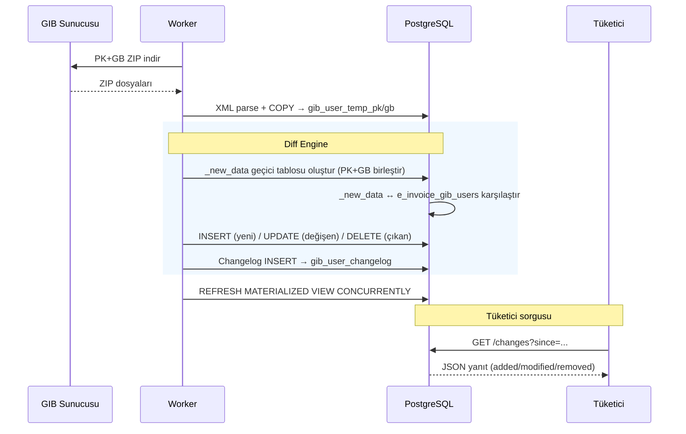
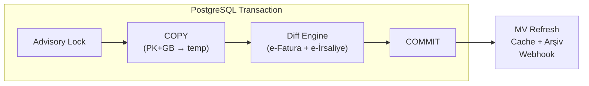
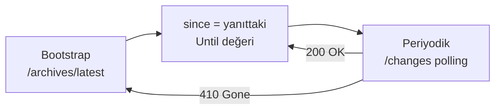
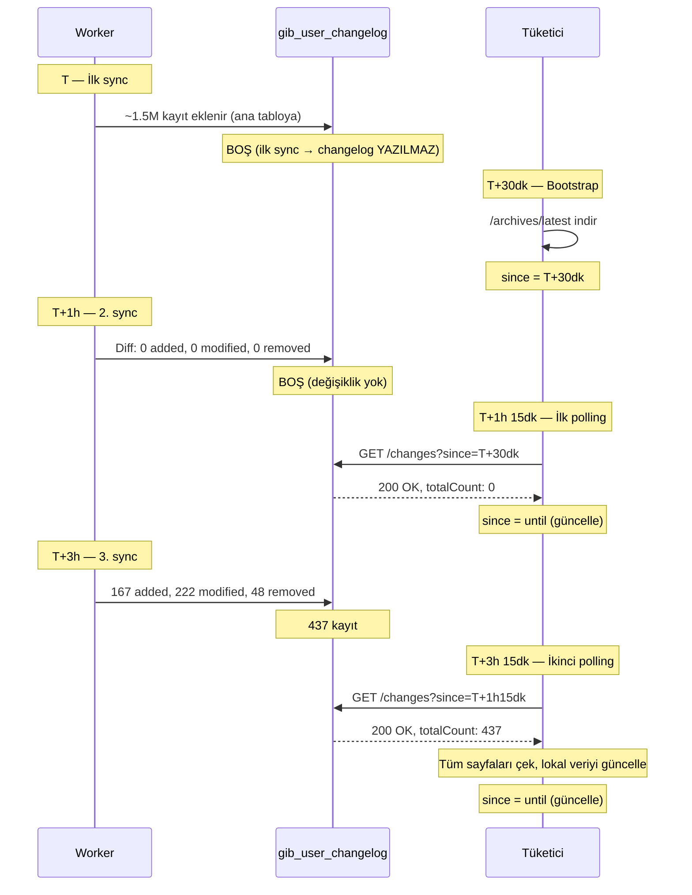

# Diff & Changelog Mekanizması

Bu doküman, GibUserList servisinin **değişiklik tespiti (diff)** ve **changelog yazma** mekanizmasını kapsamlı şekilde açıklar. Hedef kitle: sistemi entegre eden geliştiriciler, operasyon ekibi ve iç denetim.

---

## İçindekiler

- [Diff \& Changelog Mekanizması](#diff--changelog-mekanizması)
  - [İçindekiler](#i̇çindekiler)
  - [1. Genel Bakış](#1-genel-bakış)
  - [2. Veri Akışı — Büyük Resim](#2-veri-akışı--büyük-resim)
  - [3. Adım Adım Diff Süreci](#3-adım-adım-diff-süreci)
    - [3.1 Hazırlık: `_new_data` Geçici Tablosu](#31-hazırlık-_new_data-geçici-tablosu)
    - [3.2 Eklenen Kayıtların Tespiti (Added)](#32-eklenen-kayıtların-tespiti-added)
    - [3.3 Değişen Kayıtların Tespiti (Modified)](#33-değişen-kayıtların-tespiti-modified)
    - [3.4 Silinen Kayıtların Tespiti (Removed)](#34-silinen-kayıtların-tespiti-removed)
    - [3.5 content\_hash Nedir?](#35-content_hash-nedir)
  - [4. İlk Senkronizasyon Davranışı](#4-i̇lk-senkronizasyon-davranışı)
  - [5. Changelog Tablosu](#5-changelog-tablosu)
    - [5.1 Tablo Yapısı](#51-tablo-yapısı)
    - [5.2 Changelog Yazma Mantığı](#52-changelog-yazma-mantığı)
    - [5.3 Retention (Saklama Süresi)](#53-retention-saklama-süresi)
  - [6. Güvenlik Mekanizmaları](#6-güvenlik-mekanizmaları)
    - [6.1 Advisory Lock](#61-advisory-lock)
    - [6.2 Removal Guard (Güvenli Silme Koruyucusu)](#62-removal-guard-güvenli-silme-koruyucusu)
    - [6.3 Transactional Bütünlük](#63-transactional-bütünlük)
  - [7. Consumer (Tüketici) API](#7-consumer-tüketici-api)
    - [7.1 Endpoint](#71-endpoint)
    - [7.2 Retention Kontrolü (410 Gone)](#72-retention-kontrolü-410-gone)
    - [7.3 Sayfalama](#73-sayfalama)
    - [7.4 Yanıt Yapısı](#74-yanıt-yapısı)
  - [8. Tüketici Senkronizasyon Protokolü](#8-tüketici-senkronizasyon-protokolü)
    - [Tüketici Kuralları](#tüketici-kuralları)
    - [Neden `until` Değeri Kritik?](#neden-until-değeri-kritik)
  - [9. Senaryo Analizi — Zaman Çizelgesi](#9-senaryo-analizi--zaman-çizelgesi)
    - [9.1 Normal Akış](#91-normal-akış)
    - [9.2 Edge Case'ler](#92-edge-caseler)
      - [A. Tüketici bootstrap yapmadan polling başlatırsa](#a-tüketici-bootstrap-yapmadan-polling-başlatırsa)
      - [B. Retention süresi dolarsa](#b-retention-süresi-dolarsa)
      - [C. Sunucu çökerse (sync ortasında)](#c-sunucu-çökerse-sync-ortasında)
      - [D. Tüketici uzun süre offline kalırsa](#d-tüketici-uzun-süre-offline-kalırsa)
      - [E. Removal guard tetiklenirse](#e-removal-guard-tetiklenirse)
      - [F. Aynı anda iki Worker çalışırsa](#f-aynı-anda-iki-worker-çalışırsa)
  - [10. Yapılandırma Referansı](#10-yapılandırma-referansı)
  - [11. Sıkça Sorulan Sorular](#11-sıkça-sorulan-sorular)

---

## 1. Genel Bakış

GIB (Gelir İdaresi Başkanlığı), e-Fatura ve e-İrsaliye mükellef listelerini PK/GB ZIP dosyaları olarak yayınlar. Bu dosyalar **tüm aktif mükelleflerin tam listesini** içerir; GIB tarafında delta/diff mekanizması yoktur — her seferinde tam liste yayınlanır.

Bu servisin diff mekanizması, ardışık iki tam senkronizasyon arasındaki **farkı tespit eder** ve bu farkları `gib_user_changelog` tablosuna yazar. Bu sayede tüketici uygulamalar tam listeyi tekrar tekrar işlemek yerine yalnızca değişiklikleri (delta) sorgulayabilir.



---

## 2. Veri Akışı — Büyük Resim

Worker her çalıştığında (Kubernetes CronJob veya cron) aşağıdaki adımlar **tek bir PostgreSQL transaction** içinde gerçekleşir:



**Transaction icindeki adimlar:**

| # | Adim | Aciklama |
|---|------|----------|
| 1 | Advisory Lock | `pg_try_advisory_xact_lock` — es zamanli calismayi engeller |
| 2 | Temp tablolari temizle | `TRUNCATE gib_user_temp_pk/gb` |
| 3-4 | PK+GB XML → COPY | Stream parse + 25K batch COPY |
| 5 | Index olustur | Temp tablolara identifier + JSONB index |
| 6 | Diff Engine: e-Fatura | `_new_data` olustur → Added/Modified/Removed tespit → INSERT/UPDATE/DELETE → Changelog yaz |
| 7 | Diff Engine: e-Irsaliye | Ayni adimlar |
| 8 | Retention temizligi | Eski changelog kayitlarini sil |
| 9 | sync_metadata guncelle | Son sync zamani, durum, hata ozeti |

**Transaction sonrasi:** MV Refresh (retry destekli) → Cache invalidation → Arsiv uret (XML.GZ) → Eski arsivleri temizle → Webhook bildirimi

Tüm diff ve veri güncelleme işlemleri tek transaction içinde olduğu için herhangi bir adımda hata olursa **tüm değişiklikler geri alınır**. Kısmen güncellenmiş veri veya tutarsız changelog oluşması mümkün değildir.

---

## 3. Adım Adım Diff Süreci

### 3.1 Hazırlık: `_new_data` Geçici Tablosu

Diff engine ilk iş olarak GIB'den gelen ham verileri (temp tablolardaki PK ve GB kayıtları) birleştirerek `_new_data` adlı geçici tabloyu oluşturur. Bu tablo transaction sonunda otomatik düşürülür (`ON COMMIT DROP`).

```sql
CREATE TEMP TABLE _new_data ON COMMIT DROP AS
WITH docs AS (
    -- PK tablosundan ilgili belge türünü çıkar (Invoice veya DespatchAdvice)
    SELECT t.identifier, t.account_type, t.first_creation_time,
           t.title, t.title_lower, t.type, d.value AS doc
    FROM gib_user_temp_pk t
    CROSS JOIN LATERAL jsonb_array_elements(t.documents) d
    WHERE d.value ->> 'Type' = 'Invoice'    -- veya 'DespatchAdvice'
    UNION ALL
    -- GB tablosundan aynı filtre
    SELECT t.identifier, t.account_type, t.first_creation_time,
           t.title, t.title_lower, t.type, d.value AS doc
    FROM gib_user_temp_gb t
    CROSS JOIN LATERAL jsonb_array_elements(t.documents) d
    WHERE d.value ->> 'Type' = 'Invoice'
),
flat_aliases AS (
    -- Her kullanıcının alias'larını düzleştir
    SELECT docs.identifier, docs.account_type, docs.first_creation_time,
           docs.title, docs.title_lower, docs.type, a.value AS al
    FROM docs
    CROSS JOIN LATERAL jsonb_array_elements(docs.doc -> 'Aliases') a
),
aggregated AS (
    -- Aynı VKN/TCKN'li kayıtları birleştir (PK+GB çakışması)
    SELECT
        identifier,
        MAX(account_type) AS account_type,
        MAX(first_creation_time) AS first_creation_time,
        MAX(title) AS title,
        MAX(title_lower) AS title_lower,
        MAX(type) AS type,
        jsonb_agg(al ORDER BY al ->> 'Alias', al ->> 'Type') AS aliases_json,
        string_agg(
            (al ->> 'Alias') || ':' || (al ->> 'Type'), ','
            ORDER BY al ->> 'Alias', al ->> 'Type'
        ) AS alias_signature
    FROM flat_aliases
    GROUP BY identifier
)
SELECT
    identifier, account_type, first_creation_time,
    title, title_lower, type, aliases_json,
    md5(
        identifier ||
        COALESCE(title_lower, '') ||
        COALESCE(account_type, '') ||
        COALESCE(type, '') ||
        first_creation_time::text ||
        COALESCE(alias_signature, '')
    ) AS content_hash
FROM aggregated;
```

**Neden PK ve GB birleştirilir?** GIB, mükellef verilerini iki ayrı listede yayınlar: PK (Posta Kutusu) ve GB (Gönderici Birim). Aynı mükellef her iki listede de bulunabilir. Bu sorgu, aynı VKN/TCKN'ye sahip kayıtları birleştirip tüm alias'larını tek satırda toplar.

### 3.2 Eklenen Kayıtların Tespiti (Added)

`_new_data`'da olup ana tabloda olmayan VKN/TCKN'ler:

```sql
SELECT nd.identifier FROM _new_data nd
LEFT JOIN e_invoice_gib_users t ON t.identifier = nd.identifier
WHERE t.identifier IS NULL;
```

### 3.3 Değişen Kayıtların Tespiti (Modified)

Her iki tabloda da olup `content_hash` değeri farklı olan kayıtlar:

```sql
SELECT nd.identifier FROM _new_data nd
INNER JOIN e_invoice_gib_users t ON t.identifier = nd.identifier
WHERE t.content_hash IS DISTINCT FROM nd.content_hash;
```

`IS DISTINCT FROM` operatörü NULL-safe karşılaştırma yapar — yani bir tarafın NULL olduğu durumlar da doğru şekilde ele alınır.

### 3.4 Silinen Kayıtların Tespiti (Removed)

Ana tabloda olup `_new_data`'da olmayan VKN/TCKN'ler:

```sql
SELECT t.identifier FROM e_invoice_gib_users t
LEFT JOIN _new_data nd ON nd.identifier = t.identifier
WHERE nd.identifier IS NULL;
```

Bu VKN/TCKN'lerin GIB listesinden çıktığı anlamına gelir — mükellef artık ilgili belge türünde kayıtlı değildir.

### 3.5 content_hash Nedir?

Her mükellef kaydı için aşağıdaki alanların birleşiminden MD5 hash üretilir:

```
md5(identifier + title_lower + account_type + type + first_creation_time + alias_signature)
```

| Alan | Açıklama |
|------|----------|
| `identifier` | VKN/TCKN |
| `title_lower` | Ünvan (küçük harfe dönüştürülmüş) |
| `account_type` | Hesap türü (Özel, Kamu, vb.) |
| `type` | Kullanıcı türü (Kağıt, vb.) |
| `first_creation_time` | İlk oluşturulma zamanı |
| `alias_signature` | Tüm alias'ların sıralı birleşimi (`Alias:Type,Alias:Type,...`) |

Bu hash sayesinde mükellefin herhangi bir alanı değiştiğinde (ünvan değişikliği, yeni alias eklenmesi, hesap türü güncellenmesi vb.) kayıt "modified" olarak tespit edilir. Hash değişmemişse kayıt atlanır — gereksiz UPDATE yapılmaz.

---

## 4. İlk Senkronizasyon Davranışı

Worker ilk kez çalıştığında ana tablolar boştur. Bu durumda GIB'den gelen tüm kayıtlar (~1.5M) "added" olarak tespit edilir. Ancak bu kayıtların changelog'a yazılması gereksiz ve maliyetlidir:

- ~1.5M changelog kaydı oluşturulması disk ve I/O yükü yaratır.
- Hiçbir tüketici bu bilgiye ihtiyaç duymaz çünkü tüketici henüz bootstrap yapmamıştır.
- Tüketici bootstrap'ını zaten `/archives/latest` ile tam liste indirerek yapar.

Bu nedenle **ilk senkronizasyonda changelog'a yazma atlanır**:

```csharp
var currentCount = await QueryScalarAsync<long>(/* SELECT COUNT(*) FROM ana_tablo */);
var isInitialSync = currentCount == 0 && addedIdentifiers.Count > 0;

if (!isInitialSync)
{
    // Sadece sonraki senkronizasyonlarda changelog'a yaz
    var changelogSql = GibSyncSqlBuilder.BuildChangelogInsertSql(...);
    await ExecuteNonQueryAsync(changelogSql);
}
```

**Tespit mantığı:** Ana tabloda hiç kayıt yoksa (`currentCount == 0`) ve yeni kayıt varsa (`addedIdentifiers.Count > 0`) bu ilk senkronizasyondur.

---

## 5. Changelog Tablosu

### 5.1 Tablo Yapısı

```
gib_user_changelog
├── id                  UUID (PK)
├── document_type       smallint (1: e-Fatura, 2: e-İrsaliye)
├── identifier          varchar — VKN/TCKN
├── change_type         smallint (1: added, 2: modified, 3: removed)
├── changed_at          timestamp — değişikliğin yazıldığı zaman (Europe/Istanbul)
├── title               varchar — snapshot (silmelerde NULL)
├── account_type        varchar — snapshot (silmelerde NULL)
├── type                varchar — snapshot (silmelerde NULL)
├── first_creation_time timestamp — snapshot (silmelerde NULL)
└── aliases_json        jsonb — snapshot (silmelerde NULL)
```

**Snapshot prensibi:** `added` ve `modified` kayıtları, değişiklik anındaki mükellef bilgilerinin tam bir kopyasını (snapshot) içerir. Bu sayede tüketici, ek bir sorgu yapmadan değişikliğin detayını görebilir. `removed` kayıtlarında tüm alanlar NULL'dır — yalnızca hangi VKN/TCKN'nin çıktığı bilgisi tutulur.

### 5.2 Changelog Yazma Mantığı

Her sync sonunda (ilk sync hariç), tespit edilen değişiklikler tek SQL ile changelog'a eklenir:

```sql
INSERT INTO gib_user_changelog
    (id, document_type, identifier, change_type, changed_at,
     title, account_type, type, first_creation_time, aliases_json)

-- Added kayıtlar: _new_data'dan snapshot al
SELECT gen_random_uuid(), 1, nd.identifier, 1,
       NOW() AT TIME ZONE 'Europe/Istanbul',
       nd.title, nd.account_type, nd.type, nd.first_creation_time, nd.aliases_json
FROM _new_data nd WHERE nd.identifier IN ('1234567890', ...)

UNION ALL

-- Modified kayıtlar: _new_data'dan güncel snapshot al
SELECT gen_random_uuid(), 1, nd.identifier, 2,
       NOW() AT TIME ZONE 'Europe/Istanbul',
       nd.title, nd.account_type, nd.type, nd.first_creation_time, nd.aliases_json
FROM _new_data nd WHERE nd.identifier IN ('9876543210', ...)

UNION ALL

-- Removed kayıtlar: yalnızca identifier ve change_type
SELECT gen_random_uuid(), 1, '5555555555', 3,
       NOW() AT TIME ZONE 'Europe/Istanbul',
       NULL, NULL, NULL, NULL, NULL;
```

**Zaman damgası:** `NOW() AT TIME ZONE 'Europe/Istanbul'` ile changelog kayıtları Türkiye yerel saatinde (`GMT+3`) kaydedilir.

### 5.3 Retention (Saklama Süresi)

Her sync sonunda eski changelog kayıtları temizlenir:

```sql
DELETE FROM gib_user_changelog
WHERE changed_at < (NOW() AT TIME ZONE 'Europe/Istanbul') - INTERVAL '30 days';
```

Varsayılan retention süresi **30 gün**dür. `GibEndpoints__ChangeRetentionDays` ayarı ile 1-365 gün arasında yapılandırılabilir.

---

## 6. Güvenlik Mekanizmaları

### 6.1 Advisory Lock

Worker, sync işlemini başlatmadan önce PostgreSQL advisory lock alır:

```sql
SELECT pg_try_advisory_xact_lock(8370142691);
```

- Lock alınamazsa başka bir Worker zaten çalışıyor demektir → sync atlanır.
- Lock transaction sonunda otomatik serbest bırakılır.
- Bu sayede CronJob retry, manuel tetikleme veya birden fazla Worker instance durumunda veri tutarsızlığı önlenir.

### 6.2 Removal Guard (Güvenli Silme Koruyucusu)

GIB'den gelen XML dosyası bozuk, eksik veya boş gelebilir. Bu durumda neredeyse tüm mükellefler "removed" olarak tespit edilir. Bu felaket senaryosunu önlemek için:

```
Silinecek kayıt / Ana tablodaki toplam kayıt > MaxAllowedRemovalPercent (%)
```

formülü kontrol edilir. Eşik aşılırsa:

1. **Silme işlemi tamamen atlanır** — ana tablo bozulmadan kalır.
2. Changelog'a removed kaydı **yazılmaz**.
3. Webhook bildirimi gönderilir (Slack + HTTP).
4. Metrik kaydedilir (`gibuserlist_sync_removal_skipped_total`).

Varsayılan eşik: **%10**. `GibEndpoints__MaxAllowedRemovalPercent` ile ayarlanır.

### 6.3 Transactional Bütünlük

Tüm diff, INSERT, UPDATE, DELETE ve changelog yazma işlemleri **tek bir PostgreSQL transaction** içinde gerçekleşir. Herhangi bir adımda hata olursa tüm değişiklikler `ROLLBACK` edilir:

- Ana tablo kısmen güncellenmez.
- Changelog kısmen yazılmaz.
- sync_metadata güncellenmez.

**Materialized View yenilemesi** transaction dışında yapılır çünkü `REFRESH MATERIALIZED VIEW CONCURRENTLY` kendi transaction'ını gerektirir. Başarısız olursa 5s aralıklarla 2 kez daha denenir.

---

## 7. Consumer (Tüketici) API

### 7.1 Endpoint

```
GET /api/v1/einvoice/changes?since={datetime}&until={datetime}&page={int}&pageSize={int}
GET /api/v1/edespatch/changes?since={datetime}&until={datetime}&page={int}&pageSize={int}
```

| Parametre | Zorunlu | Varsayılan | Açıklama |
|-----------|---------|------------|----------|
| `since` | Evet | — | Bu tarihten sonraki değişiklikler |
| `until` | Hayır | Şu an | Bu tarihe kadar olan değişiklikler |
| `page` | Hayır | 1 | Sayfa numarası |
| `pageSize` | Hayır | 100 | Sayfa boyutu (maks 1000) |

**Tarih formatları:** ISO 8601 (`2026-02-19T10:00:00`) veya `yyyy-MM-dd HH:mm:ss` (`2026-02-19 10:00:00`).

### 7.2 Retention Kontrolü (410 Gone)

API, `since` parametresinin retention penceresi içinde olup olmadığını kontrol eder:

```
retentionCutoff = NOW() - ChangeRetentionDays gün
since < retentionCutoff → 410 Gone
```

Bu **zaman tabanlı** bir kontroldür — changelog'daki en eski kaydın tarihine değil, yapılandırılmış retention süresine dayanır. Bu sayede:

- İlk sync'te changelog boş olsa bile tüketici `410 Gone` almaz.
- Changelog'da veri olup olmadığından bağımsız tutarlı davranış sergiler.
- Retention süresi değiştirildiğinde anında etkili olur.

**410 Gone aldığında:** Tüketici tam listeyi yeniden indirmelidir (`/archives/latest`).

### 7.3 Sayfalama

Changelog sorgusu sayfalanmıştır. Yanıtta `totalCount` ve `totalPages` döner. Tüketici, tüm sayfaları sırayla çekmelidir.

### 7.4 Yanıt Yapısı

```json
{
  "changes": [
    {
      "identifier": "1234567890",
      "changeType": "added",
      "changedAt": "2026-02-19T15:00:00",
      "title": "ÖRNEK FİRMA A.Ş.",
      "accountType": "Ozel",
      "type": "Kagit",
      "firstCreationTime": "2024-06-15T00:00:00",
      "aliases": [
        { "alias": "urn:mail:defaultpk", "type": "PK", "creationTime": "2024-06-15T00:00:00" }
      ]
    },
    {
      "identifier": "5555555555",
      "changeType": "removed",
      "changedAt": "2026-02-19T15:00:00",
      "title": null,
      "accountType": null,
      "type": null,
      "firstCreationTime": null,
      "aliases": null
    }
  ],
  "totalCount": 167,
  "page": 1,
  "pageSize": 100,
  "totalPages": 2,
  "until": "2026-02-19T15:00:00"
}
```

| Alan | Açıklama |
|------|----------|
| `changeType` | `added` / `modified` / `removed` |
| `changedAt` | Değişikliğin kaydedildiği zaman (Europe/Istanbul) |
| `until` | Sorgu penceresi üst sınırı — **sonraki çağrıda `since` olarak kullanılmalıdır** |
| `title`, `accountType`, ... | Snapshot alanları — `removed` kayıtlarda `null` |

---

## 8. Tüketici Senkronizasyon Protokolü



### Tüketici Kuralları

| Kural | Açıklama |
|-------|----------|
| **K1: Bootstrap zorunlu** | İlk kullanımda `/archives/latest` ile tam listeyi indirin. |
| **K2: `until` değerini sakla** | Her `/changes` yanıtındaki `until` alanını bir sonraki çağrıda `since` olarak kullanın. |
| **K3: Boş yanıt = güncelleme yok** | `totalCount: 0` yanıtı normal — `since` değerini yine yanıttaki `until` ile güncelleyin. |
| **K4: 410 Gone = re-bootstrap** | Retention süresi dışına düştüyseniz tam listeyi yeniden indirin. |
| **K5: Polling aralığı** | 15-60 dakika önerilir. Daha sık sorgu yapılabilir ama gereksiz yük oluşturur. |
| **K6: Tüm sayfaları çekin** | `totalPages > 1` ise tüm sayfaları sırayla çekin; son sayfanın `until` değerini kullanın. |
| **K7: Idempotent işlem** | Aynı `since` ile tekrar sorgu yapılabilir — sonuç aynıdır. Ağ hatası durumunda güvenle tekrarlayın. |

### Neden `until` Değeri Kritik?

`until` alanı, sunucunun sorguyu çalıştırdığı andaki zaman damgasıdır. Tüketici bunu `since` olarak kullanarak:

- Hiçbir değişikliği kaçırmaz.
- Aynı değişikliği tekrar almaz.
- Sunucu ve tüketici saat farkından etkilenmez.

---

## 9. Senaryo Analizi — Zaman Çizelgesi

Aşağıdaki senaryo, sistemin farklı zaman noktalarındaki davranışını detaylı olarak gösterir.

### 9.1 Normal Akış

**Varsayımlar:**

- `ChangeRetentionDays = 30`
- Server ilk kez T anında çalışıyor (ana tablolar boş)



### 9.2 Edge Case'ler

#### A. Tüketici bootstrap yapmadan polling başlatırsa

```
Tüketici: /changes?since=2026-02-10T00:00:00
```

- `since` retention penceresi içindeyse → 200 OK, mevcut changelog kayıtları döner.
- Ancak tüketici tam listeye sahip olmadan delta uygulamak anlamsızdır. **K1 kuralı ihlal edilmiş olur.**
- Tüketici, eksik veriye sahip olur — bu nedenle bootstrap zorunludur.

#### B. Retention süresi dolarsa

```
Tüketici: /changes?since=2025-12-01T00:00:00    (60 gün önce)
retentionCutoff = NOW() - 30 gün = ~2026-01-20

since (2025-12-01) < retentionCutoff (2026-01-20) → 410 Gone
```

Tüketici `/archives/latest` ile re-bootstrap yapmalıdır.

#### C. Sunucu çökerse (sync ortasında)

- Transaction `ROLLBACK` edilir → ana tablo ve changelog tutarlı kalır.
- Sonraki sync normal çalışır.
- Tüketici hiçbir şey fark etmez — changelog'a hiçbir şey yazılmamıştır.

#### D. Tüketici uzun süre offline kalırsa

Tüketici 25 gün offline kaldıktan sonra polling yaparsa:

```
since = 25 gün önce
retentionCutoff = NOW() - 30 gün

since > retentionCutoff → 200 OK (hâlâ retention penceresi içinde)
```

Ancak 35 gün offline kalırsa → `410 Gone` → re-bootstrap gerekir.

#### E. Removal guard tetiklenirse

Silinecek kayıt oranı eşiği aşarsa:

- Ana tablodan kayıt **silinmez**.
- Changelog'a removed kaydı **yazılmaz**.
- Webhook bildirimi gönderilir.
- Tüketici bu sync döngüsünde silme bilgisi almaz — bu kasıtlıdır çünkü silme işlemi güvenli değildir.

#### F. Aynı anda iki Worker çalışırsa

İlk Worker advisory lock alır ve çalışır. İkinci Worker lock alamaz, "partial" durumu ile çıkar. Veri tutarsızlığı oluşmaz.

---

## 10. Yapılandırma Referansı

| Ayar | Varsayılan | Açıklama |
|------|------------|----------|
| `GibEndpoints__ChangeRetentionDays` | `30` | Changelog saklama süresi (gün). Bu süreyi geçen kayıtlar her sync'te temizlenir. |
| `GibEndpoints__MaxAllowedRemovalPercent` | `10` | Güvenli silme eşiği (%). Aşılırsa silme atlanır. |
| `GibEndpoints__BatchSize` | `25000` | COPY batch boyutu. |
| `GibEndpoints__PkListUrl` | (test URL) | PK ZIP dosyası adresi. |
| `GibEndpoints__GbListUrl` | (test URL) | GB ZIP dosyası adresi. |
| `GibEndpoints__DownloadTimeout` | `00:10:00` | HTTP indirme zaman aşımı. |

---

## 11. Sıkça Sorulan Sorular

**S: İlk sync'te neden changelog boş?**

İlk senkronizasyonda tüm kayıtlar "added" olarak tespit edilir (~1.5M). Bu kayıtların changelog'a yazılması gereksiz disk I/O yaratır ve hiçbir tüketici bu bilgiye ihtiyaç duymaz. Tüketici bootstrap'ını zaten arşiv dosyasından yapar.

**S: `_new_data` tablosu nedir?**

Her sync döngüsünde oluşturulan geçici tablodur. PK ve GB temp tablolarından ilgili belge türüne ait kayıtları birleştirir, alias'ları toplar ve `content_hash` hesaplar. Transaction sonunda otomatik düşürülür. Bu tablo hem e-Fatura hem e-İrsaliye için ayrı ayrı oluşturulur — her belge türü kendi diff döngüsüne sahiptir.

**S: content_hash değişmezse ne olur?**

Kayıt "modified" olarak tespit edilmez ve UPDATE yapılmaz. Bu, gereksiz yazma işlemlerini önler — GIB listesinde genellikle mükelleflerin büyük çoğunluğu değişmez.

**S: Silinen kayıtlarda neden title/aliases null?**

`removed` kaydı, mükellefin GIB listesinden çıktığını belirtir. Bu noktada `_new_data`'da ilgili kayıt yoktur — dolayısıyla snapshot alınacak veri yoktur. Tüketici yalnızca `identifier` ile lokal veritabanından silme işlemi yapmalıdır.

**S: Tüketici saat farkı sorunu yaşar mı?**

Hayır. Tüm zaman damgaları sunucu tarafında `NOW() AT TIME ZONE 'Europe/Istanbul'` ile üretilir. Tüketici, yanıttaki `until` değerini sonraki `since` olarak kullanır — kendi saatine bağımlı değildir.

**S: Changelog sorgusu veritabanını yorar mı?**

`gib_user_changelog` tablosunda `(document_type, changed_at)` üzerinde index vardır. Tipik bir sorgu (son 1 saatteki değişiklikler) birkaç yüz ile birkaç bin kayıt döner — milisaniye seviyesinde tamamlanır.

**S: Retention süresi değiştirilirse ne olur?**

Hemen etkili olur. Bir sonraki sync'te eski kayıtlar yeni retention'a göre temizlenir. API'deki 410 Gone kontrolü de yeni değeri kullanır. Retention düşürülürse daha fazla kayıt silinir; artırılırsa daha eski veriler korunur.

---

*Son güncelleme: 2026-02-20*
